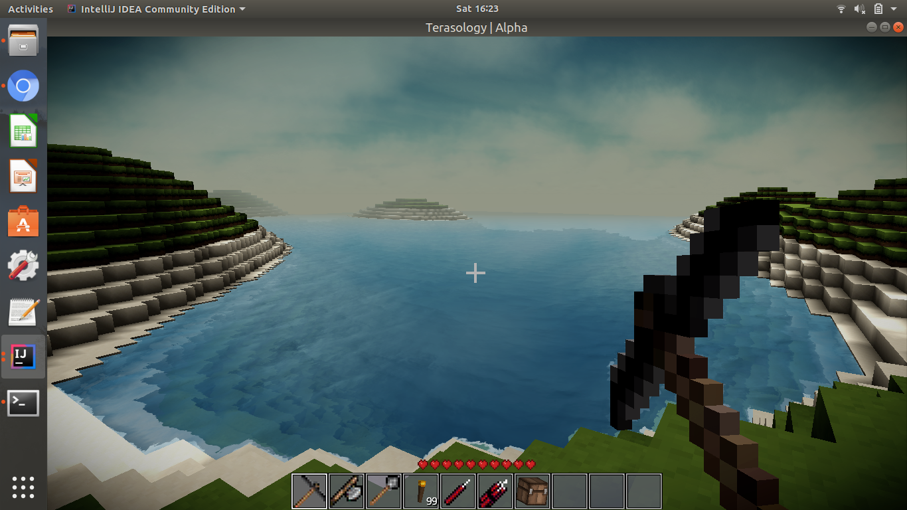
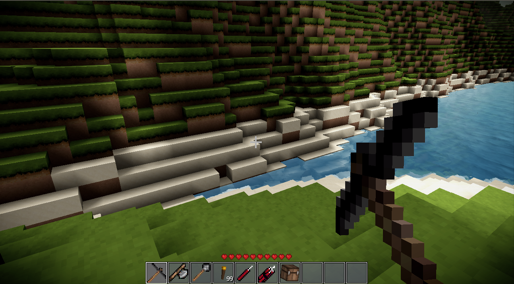
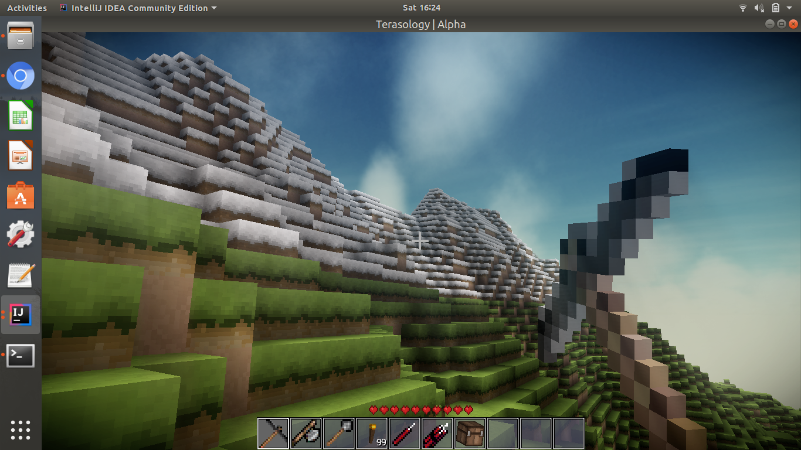
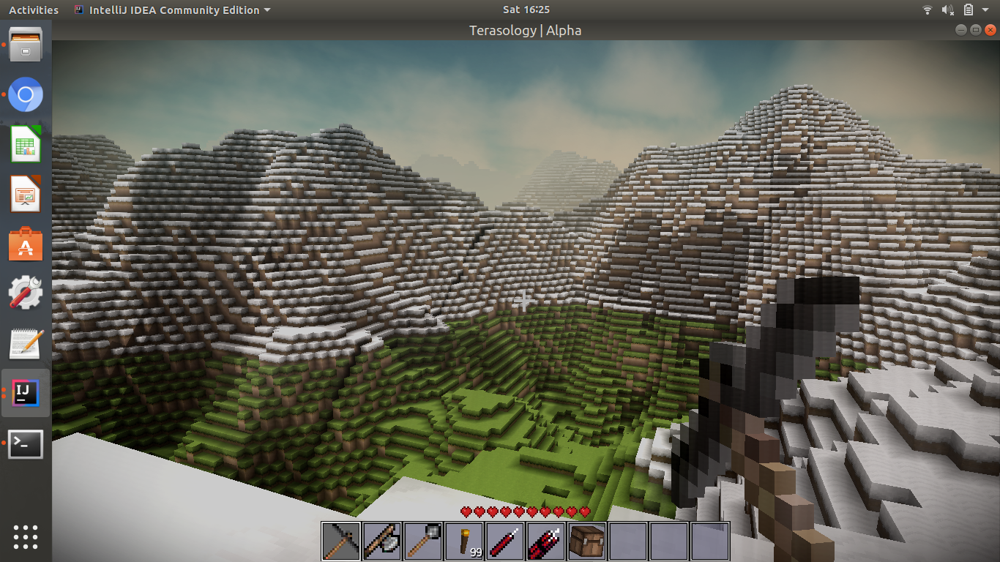
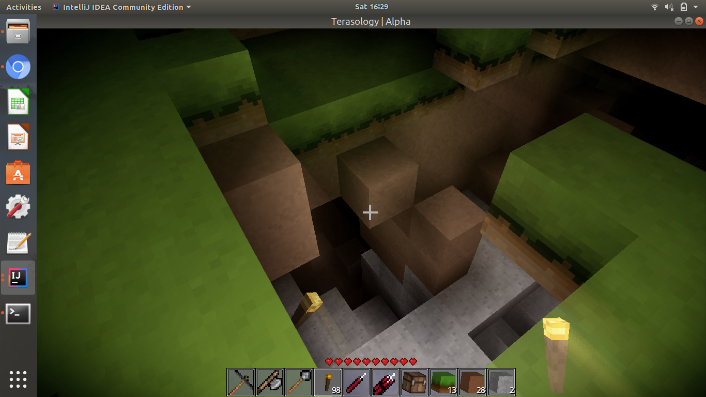

# Terasology_WorldGenerator-II

A world generator made using Terasology for GCI 2018

The terrain has the following variations :

- We have water below sea level 

- Followed by water is sandy blocks and then grass blocks

- Above 80m , we have snow blocks

- Various types of peaks and valleys

- Below Grass we have dirt followed by stone rocks

Hope you like it!!
